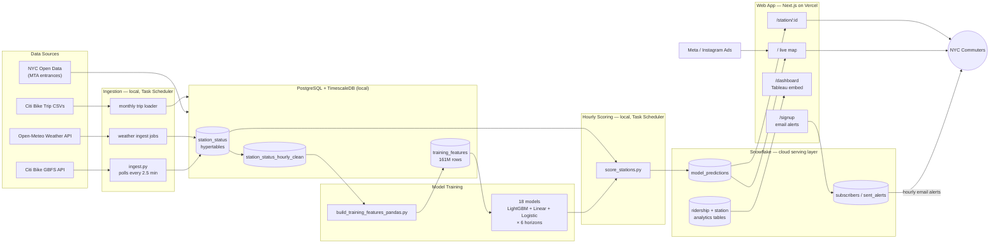

# BikePredict — Citi Bike Availability Forecasting

**Live app: [bikepredict.fyi →](https://bikepredict.fyi)**

*Will there be a Citi Bike when you need one?* This project predicts availability at every NYC Citi Bike station — from 1 hour to 2 days ahead — using machine learning models trained on years of bike activity, weather, and MTA subway data.

---

## The Problem

Citi Bike availability is unpredictable. You walk 10 minutes to a dock and it's empty. The app shows 3 bikes, but by the time you arrive they're gone. Rush hour makes it worse — stations drain in minutes, and the official app only shows what's there *right now*, not what to expect when you leave home.

---

## What I Built

A system that:
- Collects live bike availability data every 2.5 minutes from ~2,400 NYC stations
- Combines that with hourly weather forecasts and historical trip patterns
- Predicts how many bikes will be at each station 1, 3, 6, 12, and 24 hours from now
- Sends email alerts when a station is predicted to have bikes at your commute time

---

## How It Works

**1. Data collection**
An automated script polls the Citi Bike API every 2.5 minutes around the clock and saves each reading to a local database. I also pull hourly weather forecasts and historical trip data going back to 2019 — over 160 million data points in total.

**2. Model training**
I trained 18 machine learning models, one for each combination of prediction window (1 hour out, 3 hours out, and so on) and model type. The models learn from patterns like: how full is this station right now, what's the weather forecast, what time is it, and how close is the nearest subway entrance.

**3. Live predictions**
Every hour, the models score all ~2,400 active stations and push the results to a cloud database (Snowflake). The web app reads from there, so the site stays live even when my machine is off.

**4. Email alerts**
Subscribers pick a station and a delivery time. When the model predicts bikes will be available then, an alert goes out automatically.

Here's how all the pieces connect:



**Why two databases:** PostgreSQL/TimescaleDB stays local — it's the ingestion and training workhorse and doesn't need to be always-on. Predictions get pushed hourly to Snowflake, which the web app reads from, so the site stays live even when the local machine is off.

---

## Results

| Prediction window | Typical error | Correctly predicts empty/not empty |
|---|---|---|
| 1 hour ahead | ±3 bikes | 94% of the time |
| 3 hours ahead | ±5.5 bikes | 89% |
| 6 hours ahead | ±7.4 bikes | 84% |
| 12 hours ahead | ±7.7 bikes | 87% |
| 24 hours ahead | ±7.6 bikes | 87% |
| 2 days ahead | ±8.7 bikes | 83% |

The models were validated on live 2026 data after training on 2019 and 2021 data — accuracy held up or improved out-of-sample at every horizon, which is the honest signal that the model is learning real patterns, not memorizing history.

Full model analysis in [`notebooks/2.06-model-interpretation.ipynb`](notebooks/2.06-model-interpretation.ipynb).

---

## What the Data Shows

Along the way I ran seven statistical tests on the live data. A few findings:

- **E-bikes go 3.6x faster than classic bikes during rush hour** — 42% of available e-bikes are checked out per hour vs. 12% of classics. This is the data behind the commuter-targeting strategy for the ad campaign.
- **Stations near subway exits run emptier** — about 4.4 percentage points lower fill ratio on average. High foot traffic is measurable in the data.
- **Morning drain is not symmetric with evening refill** — stations lose bikes sharply in the AM rush and only partially recover in the PM.

Full writeup in [`notebooks/1.01`](notebooks/1.01-hypothesis-ebike-rush-hour.ipynb) through [`notebooks/1.07`](notebooks/1.07-hypothesis-rush-hour-usage.ipynb).

---

## The Web App

**[bikepredict.fyi](https://bikepredict.fyi)** — built with Next.js, deployed on Vercel, data from Snowflake.


**Four pages:**
- **`/`** — live map of all ~2,400 stations, color-coded green (likely available) / amber / red (likely empty). Click any dot to see the full prediction breakdown across all six time horizons, with an inline alert signup.
- **`/station/:id`** — detail view for a single station: all six predictions, a confidence range, and a departure-time picker.
- **`/dashboard`** — historical ridership trends, e-bike vs. classic splits, and demand by hour and borough (Tableau).


- **`/signup`** — email alert signup.


A Meta ad campaign is running to drive signups, with conversion tracked end-to-end through GA4 and the Meta Pixel.

---

## Repository Layout

```
citibike/
├── data_ingestion/      Live ingestion scripts (GBFS, weather, alerts) + Task Scheduler setup
├── data_historical/     One-time historical backfill scripts (Kaggle archive, subway proximity, crosswalk)
├── citibike/            Shared Python package (config, dataset, features, plots, modeling)
├── model_training/      Feature build pipeline, feature_prep.py, score_stations.py
├── notebooks/           EDA, hypothesis tests, model training/interpretation (numbered PHASE.STEP-description)
├── sql/                 Full database schema, one file per table
├── reports/figures/     Saved charts from notebooks and hypothesis tests
├── web_app/             Next.js app — live map, station detail, dashboard, signup (deployed to bikepredict.fyi)
└── docs/                Statistical analysis plan, project log
```

---

## About

I'm Clark Prenz — a real estate analyst in NYC who taught myself to build this end-to-end. I worked through the same problems a marketplace company faces: how do you predict a resource that runs out, and how do you get real users to notice you've solved it?

clark.prenz@gmail.com · [bikepredict.fyi](https://bikepredict.fyi)

---

## Tech

`Python` `pandas` `scikit-learn` `LightGBM` `Optuna` `SHAP` `PostgreSQL` `TimescaleDB` `Snowflake` `Next.js` `TypeScript` `Mapbox GL` `deck.gl` `Vercel` `Tableau` `Meta Ads`
