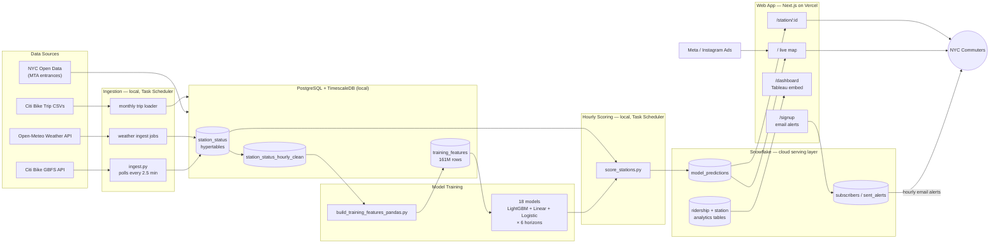
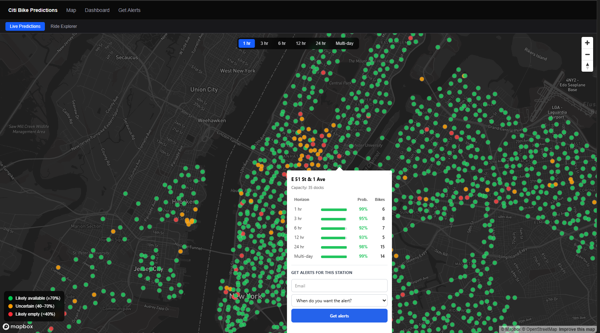
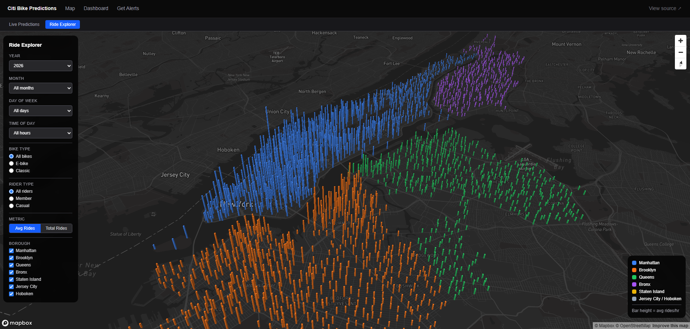
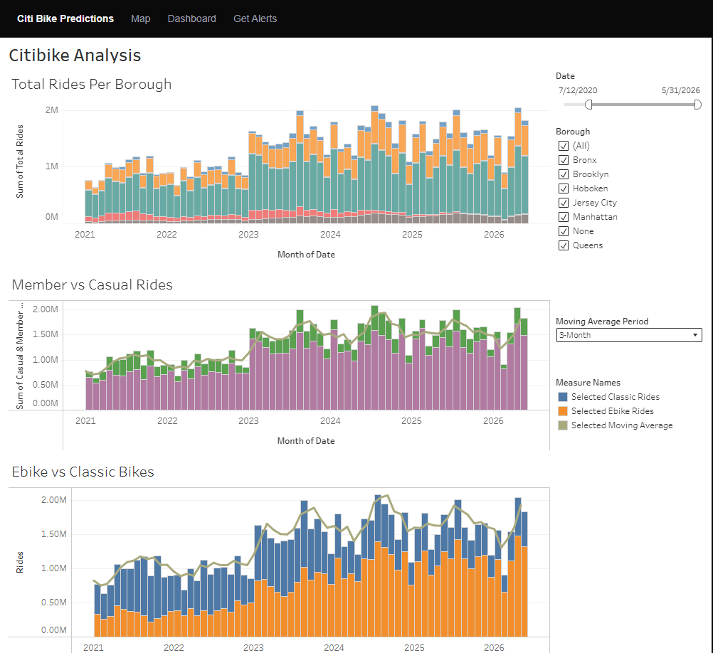
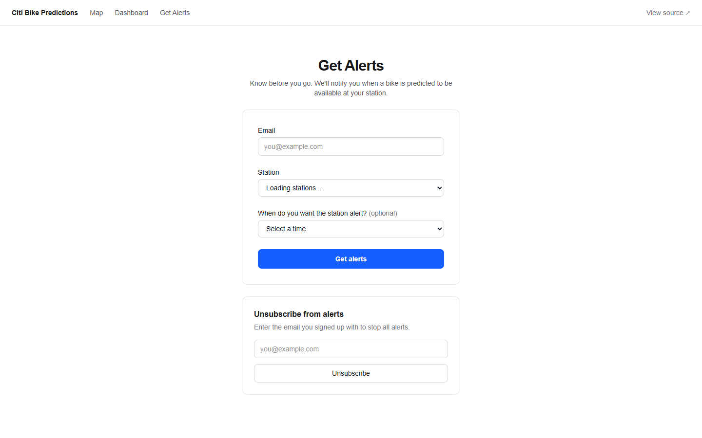
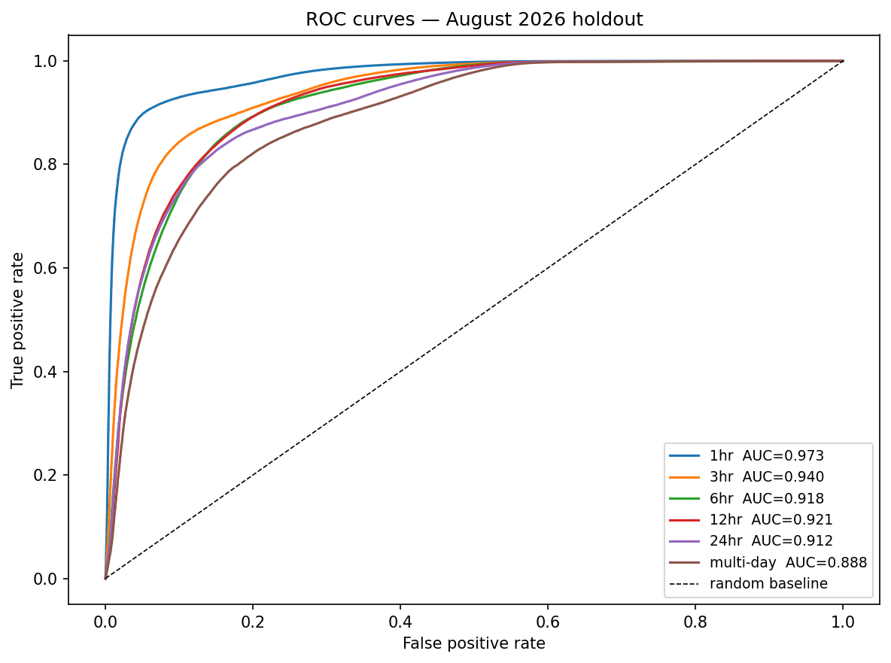
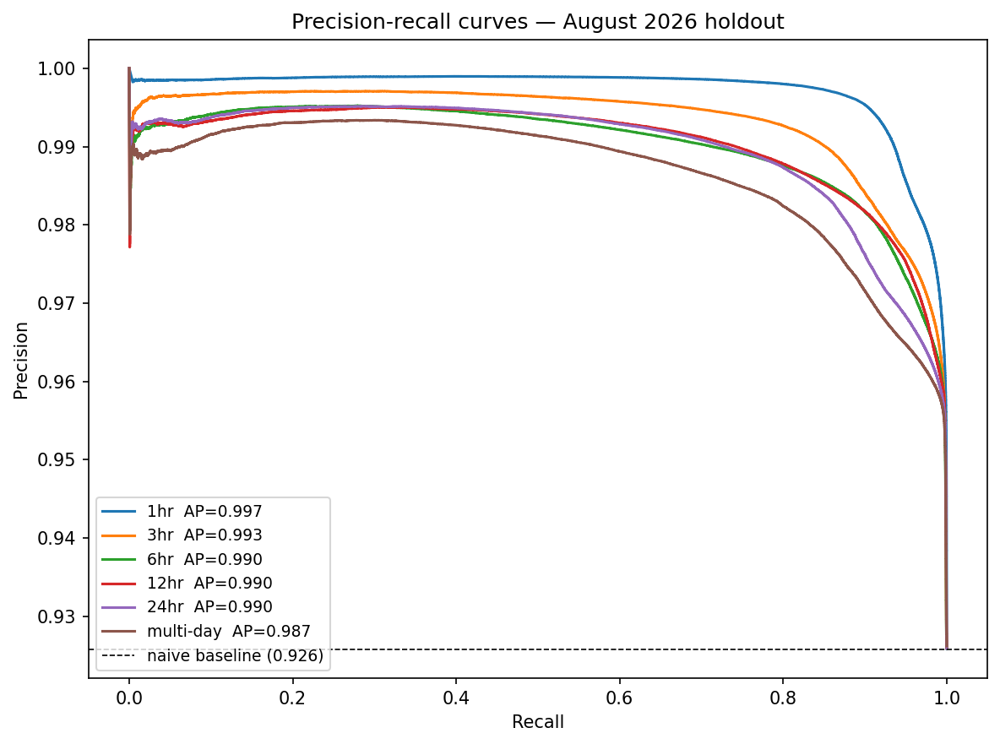

# BikePredict — Citi Bike Availability Forecasting

**Live app: [bikepredict.fyi →](https://bikepredict.fyi)**

*Will there be a Citi Bike when you need one?* This project predicts availability at every NYC Citi Bike station — from 1 hour to 2 days ahead — using machine learning models trained on years of bike activity, weather, and MTA subway data.

---

## The Problem

Citi Bike availability is unpredictable. You walk 10 minutes to a dock and it's empty. The app shows 3 bikes, but by the time you arrive they're gone. Rush hour makes it worse — stations drain in minutes, and the official app only shows what's there *right now*, not what to expect when you leave home.

---

## What I Built

A system that:
- Collects live bike availability data every 2.5 minutes from ~2,400 NYC stations
- Combines that with hourly weather forecasts and historical trip patterns
- Predicts how many bikes will be at each station 1, 3, 6, 12, and 24 hours from now
- Sends email alerts when a station is predicted to have bikes at your commute time

---

## How It Works

**1. Data collection**
An automated script polls the Citi Bike API every 2.5 minutes around the clock and saves each reading to a local database. I also pull hourly weather forecasts and historical trip data going back to 2019 — over 160 million data points in total. The three data sources are Citi Bike station status (live availability every 2.5 minutes), Open-Meteo weather (observed and forecast), and MTA subway entrance locations from NYC Open Data (used to measure each station's transit connectivity).

**2. Model training**
I trained 18 machine learning models, one for each combination of prediction window (1 hour out, 3 hours out, and so on) and model type. The models learn from patterns like: how full is this station right now, what's the weather forecast, what time is it, and how close is the nearest subway entrance.

**3. Live predictions**
Every hour, the models score all ~2,400 active stations and push the results to a cloud database (Snowflake/BigQuery). The web app reads from there, so the site stays live even when my machine is off.

**4. Email alerts**
Subscribers pick a station and a delivery time. When the model predicts bikes will be available then, an alert goes out automatically.

Here's how all the pieces connect:



**Why two databases:** PostgreSQL/TimescaleDB stays local — it's the ingestion and training workhorse and doesn't need to be always-on. Predictions get pushed hourly to Snowflake, which the web app reads from, so the site stays live even when the local machine is off.

---

## The Web App

**[bikepredict.fyi](https://bikepredict.fyi)** — built with Next.js, deployed on Vercel, data from Snowflake.





**Four pages:**
- **`/`** — live map of all ~2,400 stations, color-coded green (likely available) / amber / red (likely empty). Click any dot to see the full prediction breakdown across all six time horizons, with an inline alert signup.
- **`/station/:id`** — detail view for a single station: all six predictions, a confidence range, and a departure-time picker.
- **`/dashboard`** — analytics dashboard built in Tableau Public and embedded via iframe. Seven charts: total rides over time by borough, member vs. casual split, e-bike vs. classic split, rides by hour of day, rides by day of week, top stations ranked, and a station map sized by ridership. The data pipeline runs from BigQuery through Google Sheets into Tableau, so the dashboard refreshes nightly without any manual export. [View live dashboard](https://public.tableau.com/app/profile/clark.prenz/viz/citibike_dashboard_v1/Dashboard1)



The **Ride Explorer** (on the main map page) is a separate interactive 3D bar map built with deck.gl. Each bar represents one station, and the height shows average rides for whatever combination of year, month, day of week, and hour you select. The data sits in a pre-aggregated BigQuery table with about 18.8 million rows covering 2019, 2021, and 2026. You can filter by bike type (e-bike vs. classic), rider type (member vs. casual), and borough, and switch between that view and the live prediction map without leaving the page.

- **`/signup`** — email alert signup.



A Meta ad campaign is running to drive signups, with conversion tracked end-to-end through GA4 and the Meta Pixel.

---

## Results

| Prediction window | Typical error | AUC | Precision at threshold |
|---|---|---|---|
| 1 hour ahead | ±3 bikes | 0.973 | 97.1% |
| 3 hours ahead | ±5.5 bikes | 0.940 | 96.2% |
| 6 hours ahead | ±7.4 bikes | 0.918 | 95.9% |
| 12 hours ahead | ±7.7 bikes | 0.921 | 95.8% |
| 24 hours ahead | ±7.6 bikes | 0.912 | 95.7% |
| 2 days ahead | ±8.7 bikes | 0.888 | 95.6% |

The models were validated on live August 2026 data after training on 2019, 2021, and May through July 2026. Historical data isn't available via the Citi Bike API, so the training set was built from the Kaggle archive and a live polling pipeline I run locally. Accuracy held up or improved out-of-sample at every horizon, which is the honest signal that the model is learning real patterns, not memorizing history. The models are running right now, scoring every active station hourly and serving predictions on the live app.

AUC (area under the ROC curve) measures how well the model separates available from empty stations across all possible thresholds, before any cutoff is applied. It runs from 0.5 (random guessing) to 1.0 (perfect). The classifier was most recently retrained in September 2026 with July data added. Precision at the operating threshold stays above the 92.6% base rate at every window from 1 hour to 2 days out. When the model says a station will have a bike, it's right more than 97% of the time at 1 hour. Calibrated probability error improved 60% over the naive baseline at 1 hour.

### ROC curves



You want the ROC curves pushed toward the top-left corner. The x-axis is the false positive rate (how often the model says a station has bikes when it's actually empty) and the y-axis is the true positive rate (how often it correctly identifies stations that genuinely have bikes). The dashed diagonal is random guessing. The further a curve stays above and to the left of that line, the better the model separates available from empty stations across all possible thresholds. The 1-hour model scores 0.973.

### Precision-recall curves



With a 92.6% base rate, the precision-recall curve tells a more honest story than the ROC curve. A model that always predicts "available" is right 92.6% of the time without learning anything. The dashed horizontal line is that floor. Any curve above it means the model is adding real value on top of that naive baseline. Precision is the fraction of availability predictions that actually had a bike; recall is the fraction of genuinely available stations the model caught. The 1-hour model hits average precision of 0.997, about 7 percentage points above the base rate.

### What drives the 1-hour prediction

Top 10 features by coefficient magnitude at the 1-hour horizon, fit on a 300k-row holdout sample with QR collinearity filtering applied:

| Feature | Coefficient | z-score |
|---|---|---|
| avg_arrivals_this_hour_dow | +112.05 | 3.16 |
| avg_departures_this_hour_dow | -111.97 | -3.16 |
| precipitation | -70.40 | -0.11 |
| rain | +69.94 | +0.11 |
| avg_net_flow_this_hour_dow | +63.26 | 3.16 |
| snowfall | +8.15 | 0.11 |
| num_bikes_available | +5.42 | 40.13 |
| fill_ratio | +1.49 | 14.14 |
| num_ebikes_available | +0.74 | 10.01 |
| temperature_2m | -0.69 | -2.45 |

The most statistically significant feature by far is current bike count (z=40), followed by fill ratio and e-bike count. The arrivals and departures demand features have large coefficients because they encode similar information from opposite directions. Rain and precipitation are nearly identical measurements and their large opposing coefficients are a collinearity artifact. The weather signal that actually holds up is temperature.

For the full training run, coefficient tables across all six horizons, calibration curves, and threshold analysis, see [`notebooks/3.03-logistic-training.ipynb`](notebooks/3.03-logistic-training.ipynb).

Full regression model analysis in [`notebooks/2.06-model-interpretation.ipynb`](notebooks/2.06-model-interpretation.ipynb).

---

## What the Data Shows

Along the way I ran seven statistical tests on the live data. A few findings:

- **E-bikes go 3.6x faster than classic bikes during rush hour** — 42% of available e-bikes are checked out per hour vs. 12% of classics. This is the data behind the commuter-targeting strategy for the ad campaign.
- **Stations near subway exits run emptier** — about 4.4 percentage points lower fill ratio on average. High foot traffic is measurable in the data.
- **Morning drain is not symmetric with evening refill** — stations lose bikes sharply in the AM rush and only partially recover in the PM.

Full writeup in [`notebooks/1.01`](notebooks/1.01-hypothesis-ebike-rush-hour.ipynb) through [`notebooks/1.07`](notebooks/1.07-hypothesis-rush-hour-usage.ipynb).

---

## Ad Campaign

I ran a $50 Meta pilot to test whether the model was something real users would actually pay attention to.

**Pilot funnel**

The pilot ran on Instagram with a single commuter-targeted creative. Baseline CTR was 2.21% at $0.17 CPC. Those two numbers went into a power analysis (80% power, alpha = 0.05) to find out how large a follow-on test would need to be to detect a 1 percentage point lift in CTR. The answer was about 4,100 clicks per group, which told me the pilot itself was not big enough to draw conclusions from, and that a properly powered test would require a meaningfully larger budget. I ran the A/B test anyway to get a directional read.

**Commuter vs. general audience A/B test**

| Group | Impressions | Clicks | CTR |
|---|---|---|---|
| Commuter audience | ~3,454 | ~116 | 4.2% |
| General audience | ~4,046 | ~147 | 3.4% |

Commuter targeting outperformed general targeting (4.2% vs. 3.4% CTR). A one-tailed z-test on the difference gives p = 0.035, which is significant given the directional hypothesis from H1 and H7 (those two tests together establish that commuters are the primary e-bike users and show up specifically at rush hour). That said, the test was underpowered, so these numbers are directional only.

At a 0.7% conversion rate, the 263 combined clicks produced 2 signups.

## Repository Layout

```
citibike/
├── data_ingestion/      Live ingestion scripts (GBFS, weather, alerts) + Task Scheduler setup
├── data_historical/     One-time historical backfill scripts (Kaggle archive, subway proximity, crosswalk)
├── citibike/            Shared Python package (config, dataset, features, plots, modeling)
├── model_training/      Feature build pipeline, feature_prep.py, score_stations.py
├── notebooks/           EDA, hypothesis tests, model training/interpretation (numbered PHASE.STEP-description)
├── sql/                 Full database schema, one file per table
├── reports/figures/     Saved charts from notebooks and hypothesis tests
├── web_app/             Next.js app — live map, station detail, dashboard, signup (deployed to bikepredict.fyi)
└── docs/                Statistical analysis plan, project log
```

---

## About

I'm Clark, a real estate analyst in NYC. I built this end-to-end as a self-directed project. If you have questions about any part of it, reach out.

clark.prenz@gmail.com · [bikepredict.fyi](https://bikepredict.fyi)

---

## Tech

`Python` `pandas` `scikit-learn` `LightGBM` `Optuna` `SHAP` `PostgreSQL` `TimescaleDB` `Snowflake` `Next.js` `TypeScript` `Mapbox GL` `deck.gl` `Vercel` `Tableau` `Meta Ads`
