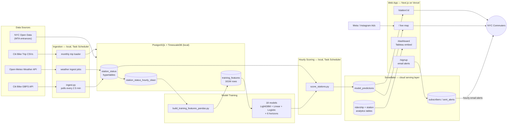

# Citi Bike Availability Forecasting

**[bikepredict.fyi →](https://bikepredict.fyi)** — live prediction map for ~2,400 NYC Citi Bike stations

An end-to-end machine learning project that forecasts bike availability at
individual docking stations across New York City, from 1 hour to multiple
days ahead. Live GBFS, weather, and MTA subway data feed a station-level
model (18 production artifacts across 6 horizons) that serves a public web
app, backed by an email alert system and a Meta ad acquisition funnel with
A/B testing.

<!--
  TODO: add 2-3 screenshots here once captured. Recommended shots:
  1. / (map view, a few stations popped open showing the probability bars)
  2. /station/:id (6-horizon prediction card + mini map)
  3. /dashboard (Tableau embed)
  Save to reports/screenshots/ and reference like:
  
-->

## About Me

<!-- TODO: personalize this — 3-4 sentences on background + what drew you to this project -->
I'm Clark Prenz, a data scientist focused on supply/demand forecasting and
experimentation. I built this project end-to-end — ingestion, feature
engineering, model training, deployment, and a live ad campaign — to work
through the same problems I'd tackle at a marketplace company like Uber,
Lyft, or Airbnb: how do you predict a resource that runs out, and how do you
get real users to notice you've solved it?

[LinkedIn](#) · [Resume](#) · clark.prenz@gmail.com

## What This Project Demonstrates

- **Forecasting at scale** — 6 prediction horizons (1hr → multi-day) × 3
  model families (LightGBM, Linear with prediction intervals, Logistic) = 18
  production models, trained on 161M+ feature rows spanning 2016–2021 and
  live 2026 data.
- **Real feature engineering, not just modeling** — capacity-normalized
  availability, observed-vs-forecast weather split (no leakage), subway
  proximity via BallTree, demand climatology, cyclical time encodings.
- **Statistical rigor** — 7 hypothesis tests (paired/Welch t-tests) on the
  live data with effect sizes and confidence intervals, not just p-values;
  a documented judgment call on metric choice (net flow vs. gross checkout
  rate) that changed a null result into a real one.
- **Production deployment** — hourly scoring pipeline, Snowflake as the
  cloud serving layer, a Next.js/Vercel web app, and a live Meta ad campaign
  with Pixel-based conversion tracking.
- **Full-stack data ownership** — from a Docker/TimescaleDB ingestion layer
  polling a live API every 2.5 minutes, to a public-facing product a
  stranger can open right now and use.

## Architecture



**Why two databases:** PostgreSQL/TimescaleDB stays local — it's the
ingestion and training workhorse and doesn't need to be always-on.
Predictions get pushed hourly to Snowflake, which the web app reads from, so
the site stays live even when the local machine scoring the models is off.

## Tech Stack

**Data & ML:** Python · pandas · scikit-learn · LightGBM · Optuna · SHAP
**Storage:** PostgreSQL · TimescaleDB (Docker) · Snowflake
**Web app:** Next.js · TypeScript · Tailwind CSS · Mapbox GL JS · deck.gl · Vercel
**Analytics/Growth:** Tableau Public · Meta Ads · Meta Pixel · GA4
**Data sources:** Citi Bike GBFS API · Open-Meteo (observed + forecast) · NYC Open Data (MTA entrances)

## Results

| Horizon | LightGBM RMSE (bikes) | Classifier ROC AUC |
|---|---|---|
| 1 hr | 3.11 | 0.938 |
| 3 hr | 5.54 | 0.889 |
| 6 hr | 7.39 | 0.839 |
| 12 hr | 7.71 | 0.871 |
| 24 hr | 7.56 | 0.865 |
| Multi-day | 8.75 | 0.829 |

Holdout evaluated on live 2026 data (era-shift check against 2019/2021
training data) — AUC held up or improved out-of-sample at every horizon,
which is the honest signal that there's no leakage. Full SHAP interpretation,
calibration curves, and per-station error maps in
[`notebooks/2.06-model-interpretation.ipynb`](notebooks/2.06-model-interpretation.ipynb).

**Hypothesis test highlight:** e-bikes check out ~3.6x faster than classic
bikes during rush hour (42% vs. 12% of available fleet/hr, 95% CI
30.2–31.0pp, Cohen's d = 0.35) — the finding that justified commuter-targeted
ad spend over broad NYC targeting. Full writeup in
[`notebooks/1.01-hypothesis-ebike-rush-hour.ipynb`](notebooks/1.01-hypothesis-ebike-rush-hour.ipynb).

## Repository Layout

```
citibike/
├── data_ingestion/      Live ingestion scripts (GBFS, weather, alerts) + Task Scheduler setup
├── data_historical/     One-time historical backfill scripts (Kaggle archive, subway proximity, crosswalk)
├── citibike/            Shared Python package (config, dataset, features, plots, modeling)
├── model_training/      Feature build pipeline, feature_prep.py, score_stations.py
├── notebooks/           EDA, hypothesis tests, model training/interpretation (numbered PHASE.STEP-description)
├── sql/                 Full database schema, one file per table
├── reports/figures/     Saved charts from notebooks and hypothesis tests
├── web_app/             Next.js app — live map, station detail, dashboard, signup (deployed to bikepredict.fyi)
├── docs/                Statistical analysis plan, project log
└── requirements.txt
```

Run Python from the project root so `from citibike... import ...` resolves.

## Setup

```bash
git clone https://github.com/cprenz/citibike_availability_predictions
cd citibike_availability_predictions

python -m venv venv
venv\Scripts\activate           # Windows
pip install -r requirements.txt

# configure DB credentials
copy data_ingestion\.env.example data_ingestion\.env   # then edit values
```

Database runs in Docker (TimescaleDB):

```bash
docker run -d --name citibike-db -p 5555:5432 \
  -e POSTGRES_DB=citibike \
  -e POSTGRES_USER=citibike_admin \
  -e POSTGRES_PASSWORD=yourpassword \
  timescale/timescaledb:latest-pg16

psql -h localhost -p 5555 -U citibike_admin -d citibike -f sql/schema.sql
```

Web app (separate `package.json` in `web_app/`):

```bash
cd web_app
npm install
npm run dev
```

## Project Status

- [x] Live ingestion pipeline — GBFS, weather, trips, MTA, all running on schedule
- [x] `training_features` table — 161M+ rows, 2016–2021 + live 2026 data
- [x] 18 production models across 6 horizons (LightGBM, Linear + prediction
      intervals, Logistic + Platt calibration)
- [x] 7 hypothesis tests with effect sizes, confidence intervals, and power analysis
- [x] Live web app — **[bikepredict.fyi](https://bikepredict.fyi)** — map,
      station detail, Tableau dashboard, email alerts
- [x] Tableau Public analytics dashboard, synced from Snowflake
- [x] Meta ad pilot campaign — live, tracked via Meta Pixel + GA4
- [ ] Full A/B test (commuter vs. general audience targeting) — pending pilot results
- [ ] Additional features (rebalancing signal, neighbor-station availability, behavioral clustering)
